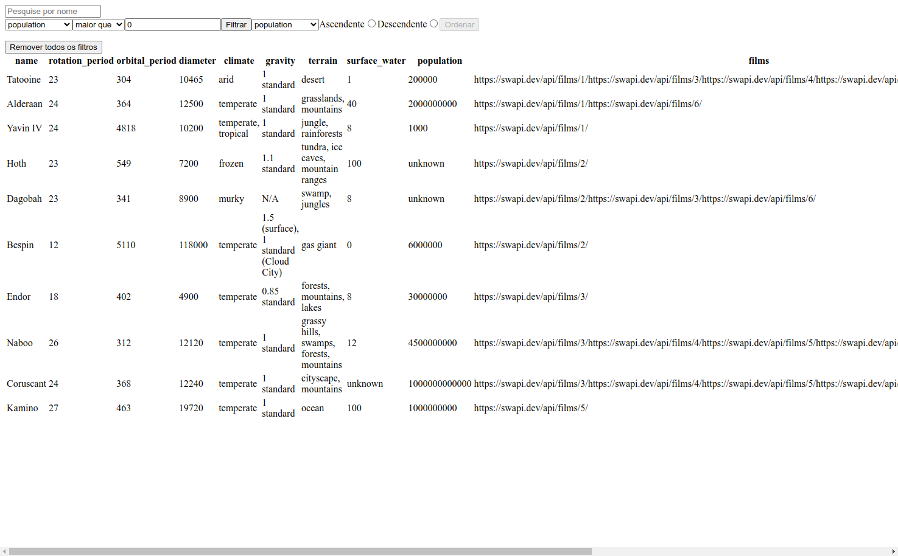

># Star Wars Planets Search

## Projeto completo! (Estilização em construção)

## Sobre o projeto
        Este projeto foi desenvolvido no módulo de front-end da Trybe, na data 12/05/2023,
        onde eu consegui colocar em prática os meus aprendizados até então.
        O projeto é uma tabela dos planetas do filme Star Wars onde o usuário além de ter
        várias informoções, ele pode filtrar por diversas coisas, como, população,
        diâmetro, entre outros. Além de também ordenar por ascendente ou descendente.
         

<<<<<<< HEAD
># 🔗 [Acesse clicando aqui!](https://luandersonalvesdev.github.io/starwars-planets-search/)
=======
># 🔗 [Acesse clicando aqui!](https://luandersonalvesdev.github.io/trybewallet/#/](https://luandersonalvesdev.github.io/starwars-planets-search/)
>>>>>>> 4299b00bb002e2ae8ce0a61bb45f829a716ea3b6

## 👨‍💻 APRENDIZADO
- Componentes funcionais.
- Uso de Hooks
- Uso do Context API.
- Filtros.
- Testes com React Testing Library.

## 🛠️ TECNOLOGIAS USADAS 
- React
- Context API
- React Testing Library

## CONTATO

https://linkedin.com/in/luandersonalvesdev
